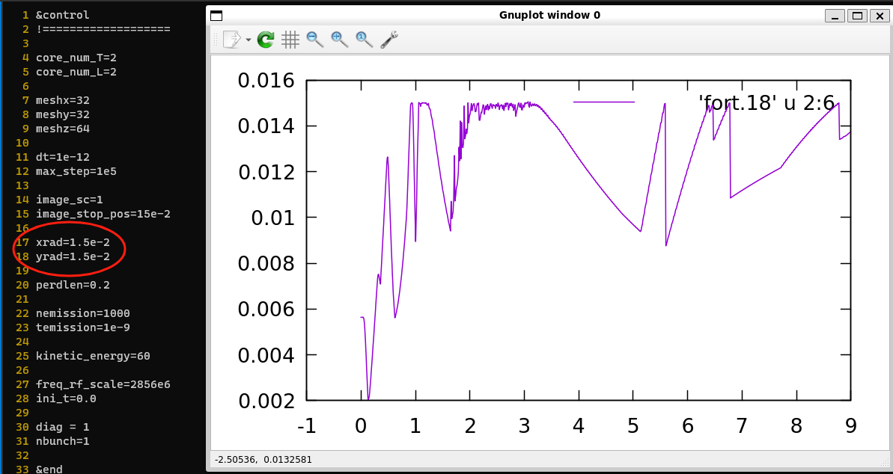

This documents describes the usage of the lattice parser we developed, which transforms lte.impt => ImpactT.in.

The parser is developed by: Biaobin Li

Email: biaobin@ustc.edu.cn


# Notes

- For 112 `EMfldCyl` element, one new field formats are added: static electric field (Poisson). The old field format is added back as `datafmt=imptold`.
- distribution 6, cylinder uniform, one could use `nbunch=10` to divide the bunch to 10 slices.
- `Typora` is recommended to view the .md file for better experiences.
- An example is added in `IMPACT-T/examples/Half-Injector-ImpactT` for illustration of the usage of the lattice parser we developed in `IMPACT-T/utilities/lattice_parser`. A report for the benchmark between `Parmela` is also uploaded.  For the new user who is interested in IMPACT-T, I think this document would help you a lot.


# Pay attention

- ==The zedge will be updated for the element which is located directly after the dipole. Be careful, ONLY dipoles inside the Chicane.==
- In dipole, now ref gam0 is used, gam0 in rfdataxxx is not used.


# Control parameters

All control parameters in `lte.impt` are listed:


| Parameter Name | Units | Type   | Default | Description                                                  |
| -------------- | ----- | ------ | ------- | ------------------------------------------------------------ |
| core_num_T     |       | int    | 1       | processor number for the transverse direction.               |
| core_num_L     |       | int    | 1       | processor number for the longitudinal direction.             |
| dt             | s     | double | 1e-12   | time step size                                               |
| max_step       |       | int    | 1e6     | maximum number of time steps                                 |
| nbunch         |       | int    | 1       | see manual for details.                                      |
| Dim            |       | int    | 6       | random seed integer                                          |
| error          |       | int    | 0       | Error study?                                                 |
| diag           |       | int    | 1       | see manual for details.                                      |
| image_sc       |       | int    | 0       | 0/1, Image charge OFF or ON.                                 |
| image_stop_pos | m     | double | 0.02    | position image charge forces are neglected.                  |
| meshx          |       | int    | 32      | number of mesh points in x direction.                        |
| meshy          |       | int    | 32      | number of mesh points in y direction.                        |
| meshz          |       | int    | 32      | number of mesh points in z direction.                        |
| Xrad           | m     | double | 0.015   | size of computational domain. Transverse size.               |
| Yrad           | m     | double | 0.015   | size of computational domain. Transverse size.               |
| PerdLen        | m     | double | 10.0    | PerdLen should be greater than the beam line lattice length. |
| Restart        |       | int    | 0       |                                                              |
| Nemission      |       | int    | -1      | the number of numerical emission steps.  `Nemission=-1` no cathode model.`Nemission=400` means it will take 400 steps for emission process, and the emission time step is `Temission/Nemission`. |
| Temission      | s     | double | 0.0     | Laser pulse emission time. `Temission=1e-9` means laser pulse is 1ns. |
| kinetic_energy | eV    | double | 0       | The real kinetic energy of the beam.                         |
| Bkenergy       | eV    | double | None    | If None, `kinetic_energy` values will be set in the python level. Particles behind the cathod will use this beta for emission. ==Question==: Under what situation would this value differs with `kinetic_energy`? |
| freq_rf_scale  | Hz    | double | 2856e6  | scale frequency $f_{scal}$,  $Scxl=c/(2\pi f_{scal}) $.      |
| ini_t          | s     | double | 0.0     | initial reference time.                                      |


`Nemission` is the total steps for emission process, `Temission` is the emission time. 

```
dt=1e-12
max_step=1e3

Nemission=100
Temission=1e-9
```

Then the emission process of 1ns would only takes 100 steps, and another 900 steps for `dt=1e-12`. When `Nemission=-1`, no cathode model, The particles are assumed to start in a vacuum. The emission process is also `dt=1e-12s`, and emission steps are 1000. 


## Nbunch

For DC-GUN, since the bunch is really long, and large energy spread is induced. `Nbunch` should be set properly to accurately perform the Lorentz transformation from lab frame to beam frame.  

The `total_charge` in each `ImpactTj.in` refers to the individual slice charge, not the total charge of the whole bunch. One can use `fort.60` and `fort.70`  3rd col (current [A]) to check whether you have set the proper values.


## perdlen

Code was changed to use perdlen to cutoff the long tail particles. Only one RF bucket is considered if perdlen is set properly.

```fortran
+        !biaobin comments: Perdlen could be used to
+        ! cutoff particles outsize (-0.5zleng,0.5zleng)
+        ptrange(5) = zcent-0.5d0*zleng/Scxlt
+        ptrange(6) = zcent+0.5d0*zleng/Scxlt
+        !ptrange(5) = 0.0
+        !ptrange(6) = zleng/Scxlt
```


# Beam parameters

All beam section parameters in `lte.impt` are listed:

| Parameter Name    | Units | Type   | Default | Description                                                  |
| ----------------- | ----- | ------ | ------- | ------------------------------------------------------------ |
| mass              | eV    | double | 0.511e6 | mass of the particle.                                        |
| charge            |       | double | -1.0    | -1 for electron.                                             |
| distribution_type |       | int    | 2       | 6D gaussian distribution. See more options in Ji’s manual.   |
| Np                |       | int    | 1e3     | particle number.                                             |
| total_charge      | C     | double | 1e-9    | charge of the beam.                                          |
|                   |       |        |         |                                                              |
| emit_x            | m rad | double | 0.0     | emitance.                                                    |
| emit_nx           | m rad | double | 0.0     | normalized emittance.                                        |
| beta_x            | m     | double | 1.0     | twiss para.                                                  |
| alpha_x           |       | double | 0.0     | twiss para.                                                  |
| sigx              | m     | double | 0.0     | rms bunch size.                                              |
| sigpx             |       | double | 0.0     | rms value of $\gamma\beta_x/\gamma_0\beta_0$                 |
| dx                | m     | double | 0.0     | offset for x                                                 |
| emit_y            | m rad | double | 0.0     | emittance.                                                   |
| emit_ny           | m rad | double | 0.0     | normalized emittance.                                        |
| beta_y            | m     | double | 1.0     | twiss para.                                                  |
| alpha_y           |       | double | 0.0     | twiss para.                                                  |
| sigy              | m     | double | 0.0     | rms bunch size.                                              |
| sigpy             |       | double | 0.0     | rms value of $\gamma\beta_y/\gamma_0\beta_0$                 |
| dy                | m     | double | 0.0     | offset for y                                                 |
| emit_z            | m rad | double | 0.0     | emittance.                                                   |
| emit_nz           | m rad | double | 0.0     | normalized emittance.                                        |
| beta_z            | m     | double | 1.0     | twiss para.                                                  |
| alpha_z           |       | double | 0.0     | twiss para.                                                  |
| sigz              | m     | double | 0.0     | rms bunch length. $z=ct$, the actual value in `ImpactT.in` is $\beta_0 ct$, this is done in the python level. |
| sigpz             | eV    | double | 0.0     | rms value of $\gamma\beta_z/\gamma_0\beta_0$                 |
| dz                | m     | double | 0.0     | offset for z, $dz=cdt$. Value is transformed in the python level to $dz=\beta_0cdt$. |

Users could either use twiss parameters to define initial beam distribution, or use rms values. For $\sigma_{ij}\neq0$ cases, please use twiss-para. 

In the definition of python level: $z=ct$.

For ijk, like `distribution_type=112`, the `sigx,sigy` actually is beam radius `r`, and `sigz` is `Lbunch` full length, which in transverse direction is circle uniform, in longitudinal direction is flat-top, and z is in $[-Lbunch, 0]$ range. `zscale` is automatically given `1e-9` value in the python code as the manual said.


## Distribution

### 112, cylinder uniform

112 could be used to generate cylinder uniform distribution.

$\sigma_{i,j,k}$ are actually refers to:
$$
sigx \rightarrow r\\
 sigz \rightarrow L_{bunch}
$$


### 6, cylinder uniform

I added it recently. The following transformation is done in the Fortran source code:
$$
\sigma_x=\sigma_y \\
r=2\times \sigma_x \\
L_{bunch}=2\sqrt{3}\sigma_z
$$
So in `lte.impt` input file,
$$
sigx \rightarrow beam~~radius~(r)\\
sigz\rightarrow bunch~~length~(L_{bunch})
$$

即，sigz 是整体束团长度。


### 7, reference particle 

Allocate one ref particle for each processor. `dz` still works.

 

# Lattice section

Right now, only a few frequently used elements in `ImpactT.in` are added into the python parser. 


## Elements

### DRIFT

0 element.

| Parameter Name | Units | Type   | Default | Description     |
| -------------- | ----- | ------ | ------- | --------------- |
| zedge          | m     | double | 0.0     | global position |
| L              | m     | double | 0.0     | length of drift |


### QUAD

1 element.

| Parameter Name | Units | Type       | Default | Description                                                  |
| -------------- | ----- | ---------- | ------- | ------------------------------------------------------------ |
| zedge          | m     | double     | 0.0     | global position                                              |
| L              | m     | double     | 0.0     | length                                                                             |
| grad           | T/m   | double     | 0.0     | quadrupole strength, $gradient=\frac{\partial B_y}{\partial x}$ |
| fileid        | m | double | 0.0  | ==If <0, include fringe field, `abs(fileid)` actually is effective length of the quadrupole.== If =0, hard edge quad with constant `grad` is applied for `L` width. If >0, `radata<fileid>` `solrf` field type is read in to reconstruct  the gradient profile. **By default value**, hard edge model is applied.  ==Different from Ji's version.== |
| radius | m | double | 17.5e-3 | aperture radius. If `fieldid>0`, `radius` will be used for edge field definition. |
| Dx             | m     | double     | 0.0     | x misalignment error                                         |
| Dy             | m     | double     | 0.0     | y misalignment error                                         |
| rotate_x       | rad   | double     | 0.0     | rotation error in x direction                                |
| rotate_y       | rad   | double     | 0.0     | rotation error in y direction                                |
| ratate_z       | rad   | double     | 0.0     | rotation error in z direction                               |
| freq           | Hz    | double     | 0.0     | rf quadrupole frequency                                      |
| phase          | deg   | double     | 0.0     | rf quadrupole phase                                          |

- Ji use `fileid>0` to apply analytical fitting model. See Ji's manual for more details.

- Ji considered the far-region (r>>0) by applying the first and second derivatives of the gradient profile along z:

$$
\begin{aligned}
B_x & =B_g y-B_g^{\prime \prime} y^3 / 6 \\
B_y & =B_g x-B_g^{\prime \prime} x y^2 / 2 \\
B_z & =B_g^{\prime} x y
\end{aligned}
$$

What I added is:

- use the gradient profile's Fourier series to reconstruct the gradient along z. 
- then, it's straightforward to get the first and second derivatives using the reconstructed gradient profile.
- However, this method is not fast enough compared with interpolation method, also slower to analytical fitting equation.


### SOL

Element 3.

| Parameter Name | Units | Type   | Default | Description     |
| -------------- | ----- | ------ | ------- | --------------- |
| zedge          | m     | double | 0.0     | global position |
| L              | m     | double | 0.0     | length          |
| fileid        |       | int    | None    | file ID         |
| scale |  | double | 1.0 | When read in field in [Gauss], scale=1e-4. |

File format:

```matlab
%[cm, Gauss ]
r1 r2 nr
z1 z2 nz

k=1;
for j=1:nz+1
    for i=1:nr+1
        br(j,i)=B(k,1);
        bz(j,i)=B(k,2);
        k=k+1;
    end
end

```

For `fileid=3`, the B field file `1T3.T7`.

`1T3.T7out` would be generated, five columns data:

```bash
s[m], Br(r=0) [gauss], Br(r=0+dr) [gauss], Bz(r=0) [gauss], Bz(r=dr) [gauss]
```


Notes:

- The manual said V2 is not used, actually it is used as the `scale` value:

	```fortran
	!see SOl.f90/getfldt_sol()
	extfld(4) = scale*br*pos(1)/rr
	extfld(5) = scale*br*pos(2)/rr
	extfld(6) = scale*bz
	```

- If the field range in r-direction is not large enough, in case the particle is outside the B-field, program will stop:

	```fortran
	          !ir=r/hr+1, hr is dr 
	          if(ir.gt.fldata%NrIntvRft) then
	             print*,"ir: ",ir,rr,pos(1),pos(2),fldata%NzIntvRft,&
	             fldata%NrIntvRft,fldata%ZmaxRft,fldata%ZminRft,fldata%RmaxRft,&
	             fldata%RminRft
	!             print*,"ir: ",ir,rr,pos(1),pos(2)
	             stop
	          endif
	```

	

- Unit in IMPACT-T fortran code, [T] is used, Ji use `scale` to transform `Gauss` to `T`, when read-in file is [cm, gauss].


### DIPOLE

Element 4.

| Parameter Name | Units | Type   | Default | Description                                                  |
| -------------- | ----- | ------ | ------- | ------------------------------------------------------------ |
| zedge          | m     | double | 0.0     | global position                                              |
| L              | m     | double | 0.0     | Blength, i.e. arc length, including the fringe and dipole field region. |
| Bx0            | T     | double | 0.0     | Bx field amplitude                                           |
| By0            | T     | double | 0.0     | By field amplitude                                           |
| fileid         |       | int    | None    | file ID to contain the geometry information of the bend      |
| half_gap       | m     | double | 40e-3   | half of gap width                                            |
| Dx             | m     | double | 0.0     | x misalignment error                                         |
| Dy             | m     | double | 0.0     | y misalignment error                                         |
| rotate_x       | rad   | double | 0.0     | rotation error in x direction                                |
| rotate_y       | rad   | double | 0.0     | rotation error in y direction                                |
| ratate_z       | rad   | double | 0.0     | rotation error in z direction                                |


关于X-Z坐标轴：

- X-Z 坐标的原点对应于 global 的zedge
- Z轴方向为参考粒子进入zedge时的方向确定

自此，X-Z坐标系唯一确定。


关于L1-L4:

- L1-L4 在X-Z坐标系下确立

重建、拟合的1D场分布，为：

- 边缘场，==垂直于L1==的路径沿线上的By分布。
- ~~中间部分，参考粒子轨迹，圆弧沿线的分布~~。 中间部分，也是垂直于磁铁边缘沿线的分布。
- 出口边缘场，==垂直于L3==的路径沿线上的分布。

并非是严格的参考粒子“看到的”By场：


边缘场部分，拟合的公式为：
$$
B_y(s)=\frac{B_0}{[1+\exp(c_0+c_1s+c_2s^2+c_3s^3+...)]}
$$
即拟合：
$$
\ln(\frac{B_0}{B_y(s)}-1)=c_0+c_1s+c_2s^2+c_3s^3+...
$$

==已知右侧边缘场分布==$f(s)$如下，宽度为L：


左侧场如对称下，分布可由右侧给出：$f(L-s)$:


同理，如对右侧边缘场拟合时，$f(\bar{s})$：
$$
\bar{s}=(s-dd2)/gap
$$
那么左侧边缘场为：
$$
\bar{s}=(-s+L-dd2)/gap=-(s-L+dd2)/gap
$$
即有：$dd1=L-dd2$.

rfdataX文件中 $line11=2~dd1$ 和 $line12=2~dd2$，应满足上述关系。


一般：

- 取`dd1=0, dd2=L`。
- 拟合系数取出右侧场进行拟合。


接下来，还有 line 21 和 line 22关于 transient CSR effect 还不太明白，but:

"Normally, these two numbers are the middle location of the fringe region. However, if transient effects at the exit are important, the total length of the bend may include a section of drift."


#### Modifications

- All the four dipoles' `k1-k4`, `Zedges` are defined in the same `Z-X Cartesian coordinate system` of the first dipole. 
- For `b1-b4` , they are in the local Z-X frame of each dipole.

So for the normal four dipole Chicane, it actually shares the same `rfdataxxx` file as:

 ```bash
   1    0.0000000e+00
   2    3.1327119e+01
   3    0.0000000e+00  !k1
   4    0.0000000e+00  !b1
   5    0.0000000e+00  !k2 
   6    3.9800000e-01  !b2
   7    0.0000000e+00  !k3
   8    4.9800000e-01  !b3
   9    0.0000000e+00  !k4
  10    8.9600000e-01  !b4
  11    7.9600000e-01
  12    0.0000000e+00
  13   -8.2280295e+00
  14    2.9174480e+00
  15    6.4235936e+00
  16   -5.3138375e+00
  17    1.7254389e+00
  18   -2.5849603e-01
  19    1.4586825e-02
  20    3.9543003e-05
  21    1.9900000e-01
  22    6.9700000e-01
 ```

- Since the `zedges` are given in the same `Z-X` coordinate system, they will be automatically updated in the code. This is because `zedges` refers to the distance ref-part travels, not `z`.

  - But this will also update the following element of the last dipole. Add one drift follows the last dipole.
  - Inside the Chicane, only dipoles, do not add any other elements. Maybe no bug, maybe there will be. I didn't check yet.

  examples see:`/afs/ifh.de/group/pitz/data/biaobin/sim1/2024/astra_demo/benchMark/05_addBend/02_EdgeEffectChicane_changeToDk1-4/02_lteimpt/edge_eff`

- In dipole, now ref gam0 is used, gam0 in rfdataxxx is not used.

- Pay attention and check whether the beam center is same as the ref particle's position. For example, see `fort.34/2:3` and `fort.38/6:2`. ==Right now, I used the beam center as $X_0$ to calculate the dispersion function.==


 


### SOLRF

element 105.

| Parameter Name | Units | Type   | Default | Description                   |
| -------------- | ----- | ------ | ------- | ----------------------------- |
| zedge          | m     | double | 0.0     | global position.              |
| L | m | double | 0.0 | the longitudinal length of the element (Blength). |
| Emax       | V/m | double | 1.0     | the absolute maximum values of on-axis Ez field. |
| freq           | Hz    | double | 2856e6  | frequency                     |
| phase          | deg   | double | 0.0     | RF design phase               |
| radius | m | double | 1.0 | pipe radius. |
| Dx             | m     | double | 0.0     | x misalignment error          |
| Dy             | m     | double | 0.0     | y misalignment error          |
| rotate_x       | rad   | double | 0.0     | rotation error in x direction |
| rotate_y       | rad   | double | 0.0     | rotation error in y direction |
| ratate_z       | rad   | double | 0.0     | rotation error in y direction |
| scaleB         |       | double | 0.0     | scale of solenoid B field.    |
| fileid | | int | None | file ID |
| z1 | m | double | None | rfdatax second line. Distance before the zedge. `None`, no update. |
| z2 | m | double | None | rfdatax third line. Distance after the zedge. `None`, no update. |
| L_fourier_exp | m | double | None | rfdatax fourth line. The length of the reconstructed field using the fourier coefficients given in rfdatax. (z1,z2,L_fourier_exp) will be used to update rfdatax line2-line4. `None`, no update. |

The traveling wave structure is modeled by two standing wave, one should use `RFcoeflcls` to get the fourier coefficients of the standing wave and the shifted standing wave, i.e. `rfdatax`. Only profile information are given for the fourier coefficients. 

~~The `z1,z2` and `length` in rfdatax will be updated according to `Lcell` and `Ncell`~~.


File format for `rfdatax`, unit is [m]。特别注意==z2-z1 could be N*Lfourier [m]==，此设置可基于一个周期cell场，拓展到整段linac：

因为，求傅里叶系数时，就是做的周期延拓。因此场将根据[z1,z2]区间，周期展开。


```
39        /# of fourier coef. of Ez on axis, ncoefreal=20
z1        / [m]
z2        / z2-z1 could be N*Lfourier [m]
Lfourier  / one-period length [m]
a0
a1
b1
a2
b2
...
a19
b19
1.0       / in case B field is 0
0.0
0.0
0.0
0.0
```

In case only B field, like solenoid file:

```
1.0       / E field is 0
0.0
0.0
0.0
0.0
39        /# of fourier coef. of Bz on axis, ncoefreal=20
z0 
z1        / z1-z0 could be N*Lfourier
Lfourier  / one-period length
a0
a1
b1
a2
b2
...
a19
b19
```

The Fourier series expansion is as following:
$$
s(x) \sim A_0+\sum_{n=1}^{\infty}\left(A_n \cos \left(\frac{2 \pi n x}{P}\right)+B_n \sin \left(\frac{2 \pi n x}{P}\right)\right)
$$
第一个系数为a0, 剩余的系数分别对应a1,b1,a2,b2。。。


`RFcoefext.f90` 和 `Rfcoeflcls.f90` 都要求场文件首位值相等，首尾相等，直接copy右移，即可周期延拓。当首尾不等时，如gun的1.6cell 场，则需作镜像对称(偶延拓)。同理，对于pitz的gun-sol 场，实际上更适合作奇延拓，此时，只需修改代码为：

```fortran
 55       zhalf = zdata(n)-zst
 56       print*,"zhalf: ",zhalf
 57       do i = n+1, 2*n
 58         zdata(i) = zdata(i-n)-zst + zhalf
 59         edata(i) = edata(i-n)
 60       enddo
 61       do i = 1, n
 62         zdata(i) = -(zdata(2*n+1-i)) + 2*zhalf
 63         !odd extension for pitz-like gun-solenoid
 64         edata(i) = -edata(2*n+1-i)
 65 
 66         !even extension, for gun RF field
 67         !edata(i) = edata(2*n+1-i)
 68       enddo
```

作奇延拓，可严格保证Bz过原点，即在cathod处Bz=0。Astra运行会提醒Bz@cathod不为零，可能就是因为代码不是用的奇延拓的方式？


奇延拓时，所有an 系数为零。

偶延拓时，所有bn 系数为零。


如果知道是奇，还是偶延拓，可以加速重建场的过程。


### TWS

Traveling wave structure. Combined `SOLRF` elements.

| Parameter Name | Units | Type   | Default  | Description                                                  |
| -------------- | ----- | ------ | -------- | ------------------------------------------------------------ |
| zedge          | m     | double | 0.0      | global position.                                             |
| L              | m     | double | 0.0      | length of the whole TWS structure linac with couplers excluded. L should be $n\times Lcav$ |
| cav_mode       | rad   | double | $2\pi/3$ | to get $Amp=Emax/sin(\beta_0d)$                              |
| Lcoup          | m     | double | 0.052464 | entrance and exit coupler field length. Default is SLAC-S-band values. To set the global position, rfdatax will also be updated. |
| Lcav           | m     | double | 0.104926 | one period length of the trwave. For $2\pi/3$  mode S-band, `Lcav=0.104926 m`. rfdatax will be updated using this value. |
| Emax           | V/m   | double | 0.0      | the absolute maximum values of on-axis Ez field.             |
| freq           | Hz    | double | 2856e6   | RF frequency                                                 |
| phase          | deg   | double | 0.0      | RF design phase.                                             |
| radius         | m     | double | 1.0      | pipe radius.                                                 |
| fileid_1       |       | int    | None     | file ID for the entrance coupler.                            |
| fileid_2       |       | int    | None     | Auto update to `fileid_1+1` in python code.                  |
| fileid_3       |       | int    | None     | Auto update to `fileid_1+2 in python code.                   |
| fileid_4       |       | int    | None     | Auto update to `fileid_1+3 in python code. file ID for the exit coupler. |
| Dx             | m     | double | 0.0      | x misalignment error                                         |
| Dy             | m     | double | 0.0      | y misalignment error                                         |
| rotate_x       | rad   | double | 0.0      | rotation error in x direction                                |
| rotate_y       | rad   | double | 0.0      | rotation error in y direction                                |
| ratate_z       | rad   | double | 0.0      | rotation error in y direction                                |

usage:

```
tws: tws, zedge=0.0, L=3*0.104926,Emax=25.5e6,freq=2856e6,phase=0.0,fileid_1=4, Lcoup=5.2464e-2,Lcav=0.104926
```

rfdata4, rfdata5, rfdata6, rfdata7 should be given.


### EMFLDCYL

112 element.

| Parameter Name | Units | Type   | Default | Description                                                  |
| -------------- | ----- | ------ | ------- | ------------------------------------------------------------ |
| zedge          | m     | double | 0.0     | global position.                                             |
| L              | m     | double | 0.0     | length of the whole TWS structure linac with couplers excluded. L should be $n\times Lcav$ |
| freq           | Hz    | double | 2856e6  | RF frequency.                                                |
| phase          | deg   | double | 0.0     | initial phase.                                               |
| fileid         |       | int    | None    | `fileid=1`,  field file is `1T1.T7`.                         |
| scale          |       | double | 1.0     | scale of the field strength.                                 |
| datafmt        |       | str    | “impt”  | the value could be `impt, imptold, poisson`. In `ImpactT.in`, corresponding values are `1,2,3`. The last one is Parmela’s static E-field format. |

The data format for `datafmt=impt,imptold,poisson` are listed as following:

```fortran
!datafmt=impt,  units are [cm,MHz,MV/m,A/m]
!--------------------------------------------
open(33,file=’1T1.T7’)
write(33,*)zmin,zmax,nmz-1
write(33,*)freq
write(33,*)rmin,rmax,nmr-1
do i=1,nmr
	do j=1,nmz
		write(33,*)Ez(j,i),Er(j,i),E(j,i),H(j,i)
	enddo
enddo
close(33)

!old version of IMPACT-T
!datafmt=imptold,  units are [cm,MHz,MV/m,A/m]
!--------------------------------------------
open(33,file=’1T1.T7’)
write(33,*)zmin,zmax,nmz-1
write(33,*)freq
write(33,*)rmin,rmax,nmr-1
do i=1,nmr
	do j=1,nmz
		write(33,*)Er(j,i),Ez(j,i),Etheta(j,i)
		write(33,*)Htheta
	enddo
enddo
close(33)

!=============================================
!datafmt=poisson, units are [cm,V/cm]
!-----------------------------------
open(33,file=’1T1.T7’)
write(33,*)rmin,rmax,nmr-1
write(33,*)zmin,zmax,nmz-1
do j=1,nmz
	do i=1,nmr
	write(33,*)Er(i,j),Ez(i,j)
	enddo
enddo
close(33)
```

Pay attention to that, for `impt,imptold`, it’s z-direction first, and then r-direction for data sampling. However, for `poisson`, which is Parmela static E-field or magnetic field format (`Poisson`), it’s r-direction first and then z-direction.

A new parameter `V12` is added for `112` element to determine the `datafmt`.


`1T1.T7out` would be generated for `datafmt=poisson`, three columns data:

```bash
s(m), Ez(r=0)[V/m], Er(r=rmax)[V/m] 
```


For electron DC gun:

```
dcgun: emfldcyl,zedge=0.0,L=6.5e-2,freq=0,phase=0,fileid=1, datafmt="poisson",scale=1.0
```

Parmela DC gun `ELEGUN1.T7`  field could be directly imported.


For 3D standing wave cavity, such as prebuncher:

```
!E0=0.19MV/m
!Emax=0.19/0.15=1.27MV/m

phipreb=93.46
Emaxfile=6.6479
Emaxpreb=0.19/0.150/Emaxfile
preb: emfldcyl, zedge=45e-2, L=20e-2, freq=476e6, phase=phipreb, fileid=3, scale=Emaxpreb, datafmt="impt"
```

Parmela prebuncher `CField` file could be directly imported.


### WATCH

-2 element.

-9 element.

| Parameter Name | Units | Type   | Default | Description                                         |
| -------------- | ----- | ------ | ------- | --------------------------------------------------- |
| zedge          | m     | double | 0.0     | global position                                     |
| filename_id    |       | int    | 80      | fort.80, should < 100. But avoid using 40,50,60,70. |
| sample_freq    |       | int    | 1       | sample out freq.                                    |
| slice_bin      |       | int    | 128     | slice bin for -9 element. See fort.180 file.        |


For slice information:

z(m), #, current(A), enx, eny, 

```Fortran
write(nfile,777)zz*scxlt,count(i),count(i)/(hz*scxlt)*sclcur*bet,epx(i)*scxlt,&
                epy(i)*scxlt,gam(i)*pmass,gam2uncor2(i)*pmass
```


### RCOL

-11 element, collimate particles with rectangular aperture.

| Parameter Name | Units | Type   | Default | Description                                        |
| -------------- | ----- | ------ | ------- | -------------------------------------------------- |
| zedge          | m     | double | 0.0     | global position                                    |
| xmax           | m     | double | 1.0     | xmax for x direction.                              |
| ymax           | m     | double | 1.0     | ymax for y direction.                              |
| xmin           | m     | double | None    | By default, xmin=None, then xmin=-xmax is applied. |
| ymin           | m     | double | None    | By default, ymin=None, then ymin=-ymax is applied. |


### MergeBin

-7 element

| Parameter Name | Units | Type   | Default | Description     |
| -------------- | ----- | ------ | ------- | --------------- |
| zedge          | m     | double | 0.0     | global position |


### SC2Dto3D

-5 element

| Parameter Name | Units | Type   | Default | Description     |
| -------------- | ----- | ------ | ------- | --------------- |
| zedge          | m     | double | 0.0     | global position |


### changedt

-4 element

| Parameter Name | Units | Type   | Default | Description     |
| -------------- | ----- | ------ | ------- | --------------- |
| zedge          | m     | double | 0.0     | global position |
| dt             | s     | double | 1e-12   | time step size  |


# Output

## fort.18

Right now, only global aperture setting in the control section.




## slice info

`fort.60` and `fort.70`, the initial 3rd col. is $I/\beta_0$, that’s why for low energy beam, it’s very large. Now the source code is updated, the 3rd col is $I$ [A] now.

changes:

```fortran
-          write(nfile,777)zz*scxlt,count(i),count(i)/(hz*scxlt)*sclcur,epx(i)*scxlt,&
+          write(nfile,777)zz*scxlt,count(i),count(i)/(hz*scxlt)*sclcur*bet,epx(i)*scxlt,&
```


## fort.40 & fort.50

7th col added:

| $x (m)$ | $\gamma\beta_x$ | $y (m)$ | $\gamma\beta_y$ | $z (m)$ | $\gamma\beta_x$ | $z (deg)$ |
| ------- | --------------- | ------- | --------------- | ------- | --------------- | --------- |

`Fort.40` is for the initial phase space, `fort.50` for the final phase space. Please NOTE, they are not the phase space at a certain time. All the particles are traced back `0.5dt` distance. It's a distribution seen by a PR target.

If you want to see the distribution at a certain moment, please use `-2`  element instead:

```bash
ww:watch,zedge=9.0,filename_id=90,slice_bin=64,sample_freq=1
line: line=(dcgun,sol1,preb,sol2,lineA1,sol3,tws,ww)
```

They all call for the `phase_Output()` function but `-2` element will not perform the trace back step. 
